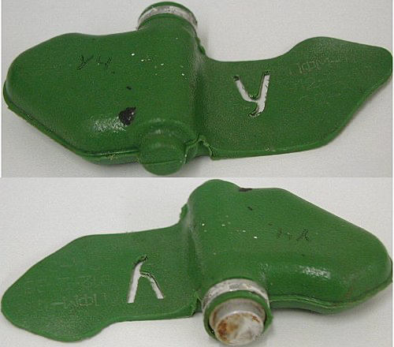

# PFM-1 Mine Detection and Tracking



## About the Project

### Getting Started

To get started

1. Clone the Repository

```bash
  git clone https://github.com/Lihemen/pfm-mine-detection-algo
```

2. Create Virtual Environment

```bash
  python3 -m venv venv
```

or (python version 3.11.x)

```bash
  python -m venv venv
```

3. Enable Virtual Environment

Mac or Linux

```bash
  source ./venv/bin/activate
```

Windows Bash

```bash
  source venv/Scripts/activate
```

Windows Powershell

```bash
  Set-ExecutionPolicy -ExecutionPolicy Bypass -Scope Process -Force
```

```bash
  .\venv\Scripts\activate.ps1
```

4. Install Dependencies

```bash
  pip install -r requirements.txt
```

5. Train the Model (optional)

6. Run the Model

7. Visualize Data

### Running Label Studio

For further labelling, run the following command in the terminal

```bash
  label-studio start
```

- Create an account using any email and password
- Upload new images to the project
- Draw bounding boxes
- Export yolov8 format when done.

### Milestones

### Challenges

### Improvements

- Collect more diverse training data (different lighting, angles, seasons)
- Use synthetic data generation for rare scenarios

Authors: [Hemense Lan](hemense.lan@student.uhasselt.be), [Simon Derwael](simon.derwael@student.uhasselt.be), [Sara Reihani](sara.reihani@student.uhasselt.be)
